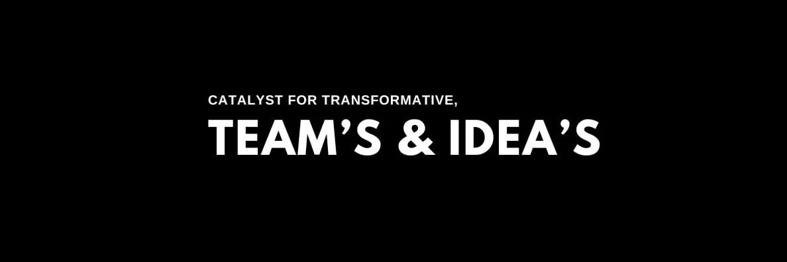

<div align="center">

</div>

<h1 align="center">PULSE (Predictive Uptime & Lifecycle Sentry Engine)</h1>

<blockquote style="font-size:18px;">
  
This <strong>AI-driven Prognostics and Health Management (PHM) platform</strong> utilizes a <strong>FastAPI backend</strong> for <strong>proactive, transparent, and intelligent asset management</strong>. It combines <strong>real-time condition monitoring</strong> with advanced models for <strong>fault detection and RUL prediction</strong>, integrating <strong>Digital Twin</strong> concepts with 
<strong>Explainable AI (XAI)</strong> to deliver <strong>clear, actionable insights for mission-critical predictive maintenance</strong>.

</blockquote>

<div>
    
    
    
    
    
</div>

## Table of Contents

- [Getting Started](#getting-started)
- [Usage](#usage)
- [Contributing](#contributing)
- [Author](#author)
- [Appendix](#appendix)
- [References](#references)
- [License](#license)

## Getting Started

1.  **Clone the repository:**

    ```bash
    git clone https://github.com/CodeDragon03/PLUSE.git
    ```

2.  **Install dependencies:**

    ```bash
    cd PLUSE

    pnpm install
    ```

## Usage

Use the following command to run the application:

```bash
python3 src/main.py
```

## Contributing

We welcome contributions\! To get started, please follow these steps:

1.  **Fork the repository** Click the "Fork" button at the top right of this
    page to create your own copy of the repository.

2.  **Clone your fork**

    ```bash
    git clone https://github.com/CodeDragon03/PLUSE.git

    cd PLUSE
    ```

3.  **Create a new branch** Use a descriptive branch name for your feature or
    bugfix.

    ```bash
    git checkout -b feature/your-feature-name
    ```

4.  **Make your changes** Implement your feature or fix the bug. Add or update
    tests and documentation as needed.

5.  **Commit your changes**

    ```bash
    git add --all

    git commit -m "Describe your changes"
    ```

6.  **Push to your fork**

    ```bash
    git push origin feature/your-feature-name
    ```

7.  **Open a Pull Request** Go to the original repository and click "New Pull
    Request". Select your branch and describe your changes.

### Contribution Tips:

- Follow the project's coding style and guidelines.
- Write clear, concise commit messages.
- Ensure all tests pass before submitting.
- Be responsive to feedback on your pull request.

### Contributors

Thanks to all the people who have contributed to this project!

<div align="start">
    <a href="https://github.com/CodeDragon03/PLUSE/graphs/contributors">
        
    </a>
</div>

## Issues

If you encounter any issues, please open an issue in the
[Issues](https://github.com/CodeDragon03/PLUSE/issues) section.

### Issue Guidelines

- Search for existing issues before creating a new one.
- Provide a clear and descriptive title.
- Include steps to reproduce the issue, expected behavior, and actual behavior.
- Attach relevant logs, screenshots, or code snippets if possible.
- Be respectful and constructive in your communication.

## Author

      Jay Yadav @CodeDragon03

## Appendix

## References

## License

This project is licensed under the
[MIT License](./LICENSE).


## [Machinery Fault Diagnostics and Signal Processing](https://nptel.ac.in/courses/112105232)

- [ ]  **Week 1: Introduction to Maintenance, Diagnostics, and Prognostics**
    - [ ]  Introduction to the Course and Maintenance Principles.
    - [ ]  Maintenance Techniques and FMECA (Failure Mode Effect and Criticality Analysis).
    - [ ]  Definitions: Fault, Detection, Isolation.
    - [ ]  Prognostics and RUL (Remaining Useful Life).
    - [ ]  Machine Learning for CBM..


- [ ]  **Week 2: Machinery Vibration (Prerequisite)**
    - [ ]  Vibration Concepts (Free and Forced Response).
    - [ ]  Vibration and Shock Isolation.
    - [ ]  Rotordynamics and Critical Speed.
    - [ ]  Practical Examples of Vibration (Relating to CBM).


- [ ]  **Week 3: Basics of Signal Processing**
    - [ ]  Time Domain Analysis.
    - [ ]  Frequency Domain Analysis.
    - [ ]  Non-Stationary Signals.
    - [ ]  Signal Manifestations (Modulation, Beating).
    - [ ]  Orbit and Order Analysis.


- [ ]  **Week 4: Data Acquisition and Special Signal Techniques**
    - [ ]  Data Acquisition (DAQ):
        - [ ]  Ill Effects and Limits of DAQ.
        - [ ]  Errors in DAQ.
        - [ ]  Wireless Data Acquisition
    - [ ]  Special Techniques:
        - [ ]  Cepstrum Analysis.
        - [ ]  Hilbert Transform (Envelope Analysis).


- [ ]  **Week 5: Numericals**
    - [ ]  Numericals on Signal Processing.
    - [ ]  Signal Heterodyning.
    - [ ]  Practical Signals from Machines for CBM.


- [ ]  **Week 6: Instrumentation and Signal Conditioning**
    - [ ]  Overview of Instrumentation
    - [ ]  Signal Conditioning and Filtering
    - [ ]  Errors in Measurement
    - [ ]  Dynamic Range and Frequency Response of Transducers
    - [ ]  List of Transducers for Different CBM Techniques


- [ ]  **Week 7: Noise and Vibration Measurements**
    - [ ]  Noise and Vibration Measure Transducers
    - [ ]  Rotational Speed Measurement for CBM


- [ ]  **Week 8: Faults in Rotating Machines (I)**
    - [ ]  Obvious Faults
        - [ ]  Unbalance and Balancing
        - [ ]  Misalignment
        - [ ]  Crack
        - [ ]  Looseness


- [ ]  **Week 9: Faults in Rotating Machines (II) and Diagnostic Chart**
    - [ ]  Faults in Machine Components
        - [ ]  Bearings (Journal)
        - [ ]  Gears
        - [ ]  Pumps
        - [ ]  Engines
    - [ ]  Machinery Diagnostic Chart


- [ ]  **Week 10: Other CBM Technique**
    - [ ]  Principles of MCSA (Motor Current Signature Analysis)
    - [ ]  Faults in Electrical Machines
    - [ ]  Thermography
    - [ ]  Wear Debris Analysis and Oil Analysis


- [ ]  **Week 11: Non-Destructive Testing (NDT) and Other Techniques**
    - [ ]  NDT Techniques (Ultrasonic, Radiography, Eddy Current)
    - [ ]  TCM (Tool Condition Monitoring) via Sensor Fusion
    - [ ]  EMA (Experimental Modal Analysis) and Resonance


- [ ]  **Week 12: Failure Analysis and Case Studies**
    - [ ]  Failure Analysis
    - [ ]  Case Studies.
